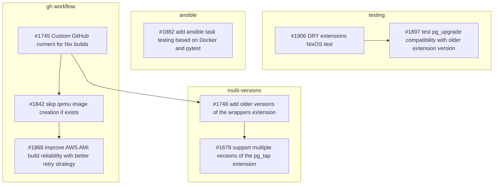
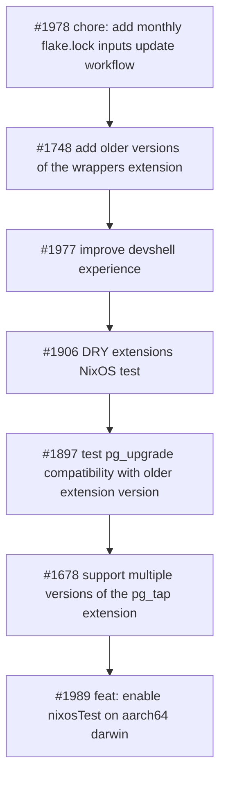
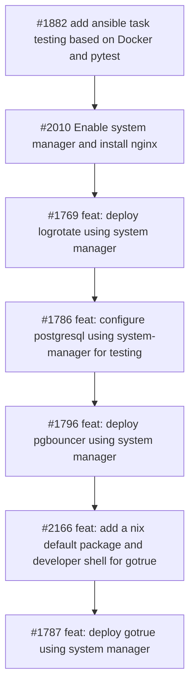

I went through the dependency graph of our open PRs in the supabase/postgres repository to identify which PRs need to be merged before others. The goal is to prioritize merging PRs that unblock multiple other PRs and the one that enable the next postgres upgrade. Here is a first graph of the dependencies between the open PRs:

Based on this graph, I propose the following order for merging PRs:

Here is a another view focusing on the system-manager PRs:

